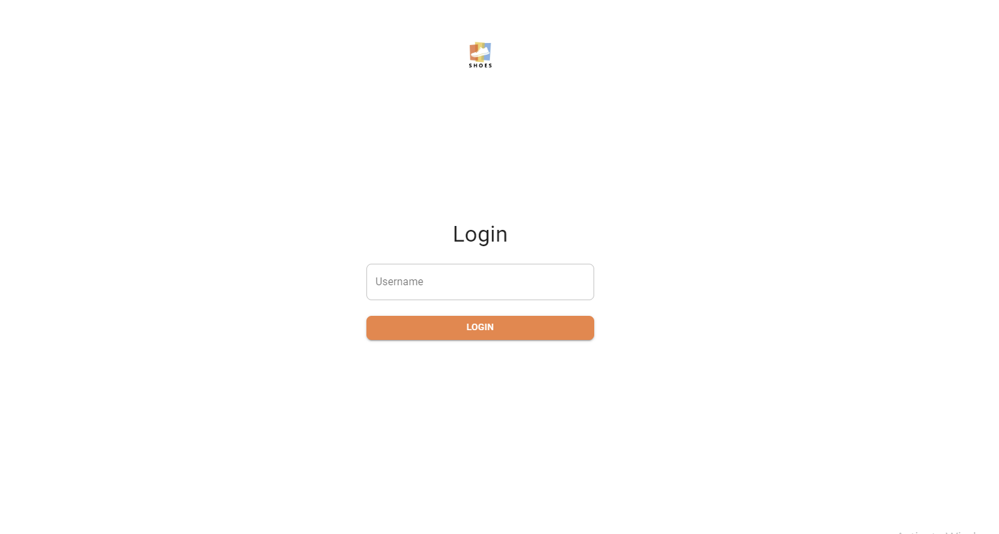
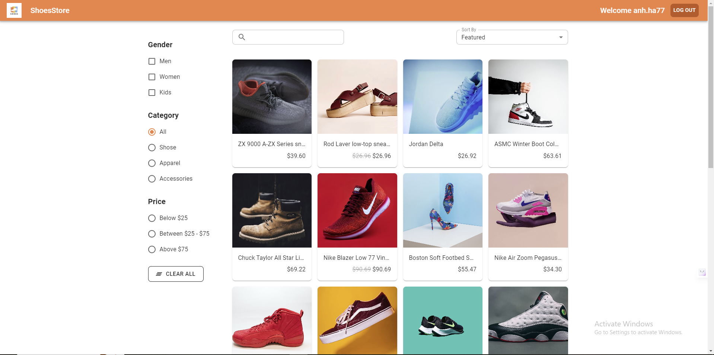
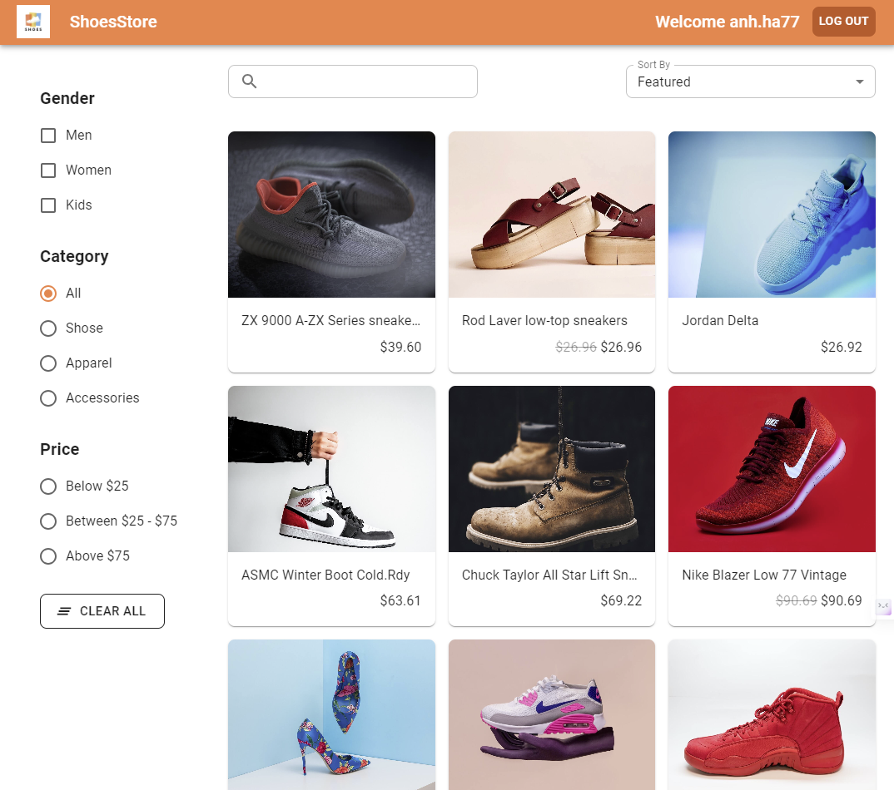
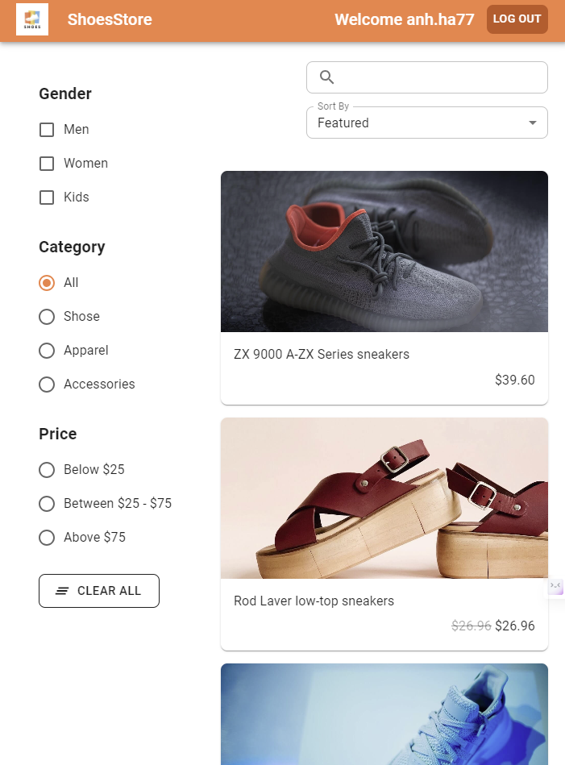
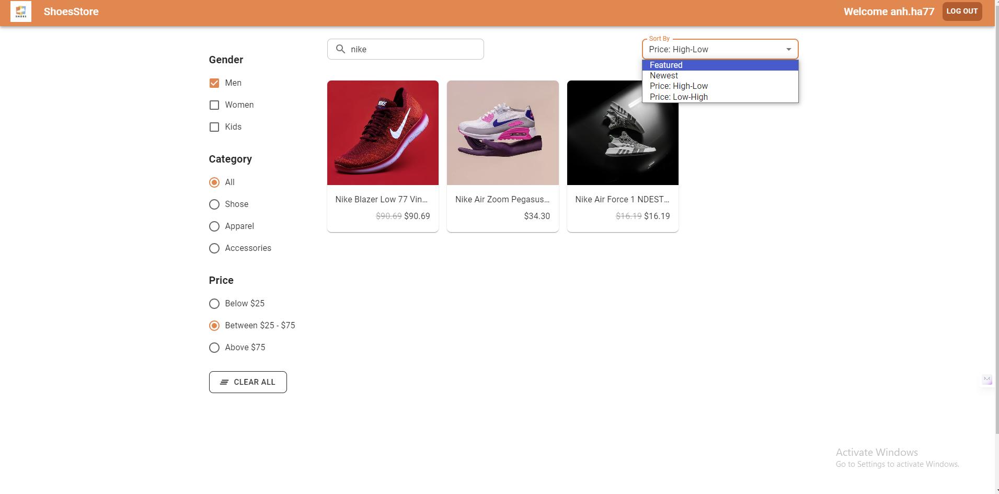
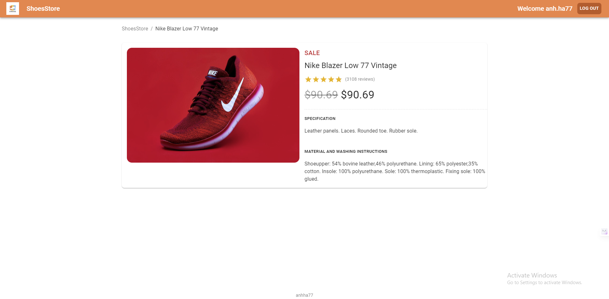
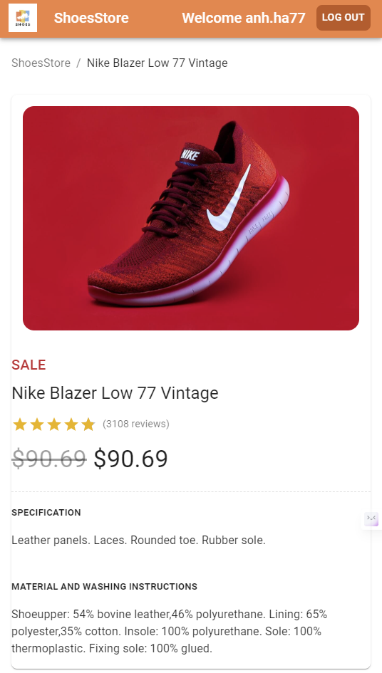

# Shoes store

## Description

A front end shoes store that let people login and search for the shoes they want and view shoes detail.

## Technologies

React, react-router-dom, react-hook-form, axios, material ui v5

## Setup json server for shoes store

```
npx json-server --watch db.json --port 5000
```

## Run react app

```
npm start
```

## Result

### Login Page



### Home Page







### Filter Item



### View Detail




